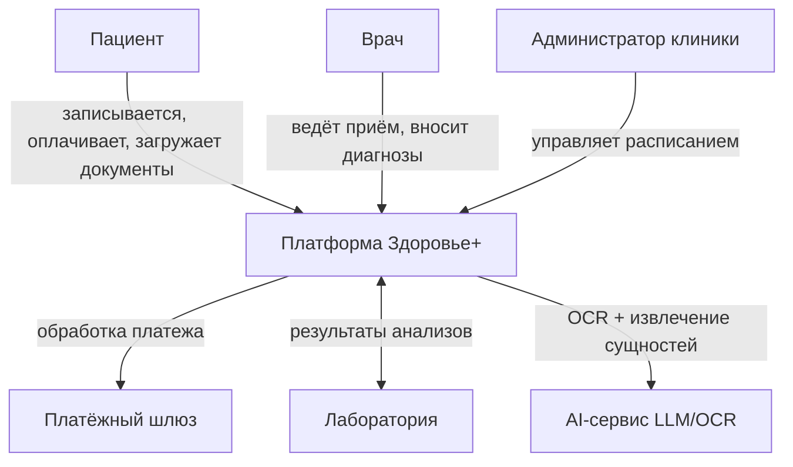
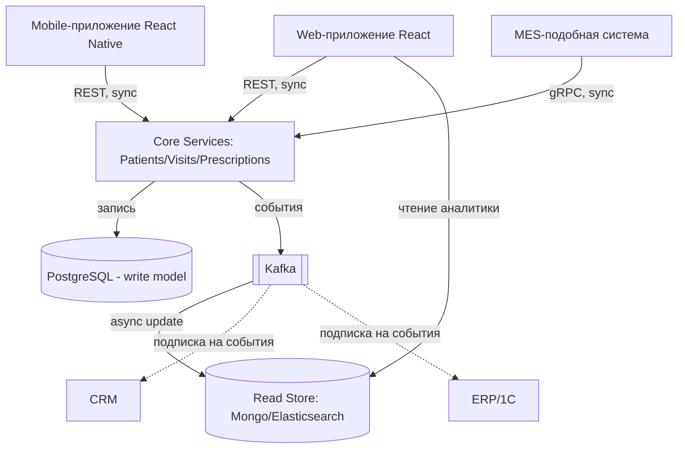

## Context diagram
Система: Платформа "Здоровье+"
Пользователи:
  - Пациент — записывается на приём, оплачивает, смотрит результаты анализов, загружает документы
  - Врач — ведёт приём, смотрит карту пациента, вносит диагнозы/назначения
  - Администратор клиники — управляет расписанием, обрабатывает обращения

Внешние системы:
  - Платёжный шлюз — обработка онлайн-оплаты
  - Лаборатория (внешняя или собственная) — передача результатов анализов
  - AI-сервисы (LLM/OCR провайдер) — обработка документов и текста

Платформа "Здоровье+" взаимодействует со всеми участниками и внешними системами как единое целое (детали внутреннего устройства скрыты на этом уровне).

## Container diagram

Контейнеры внутри платформы "Здоровье+":

1. Web-приложение (React) — запись на приём, просмотр анализов, онлайн-оплата
2. Mobile-приложение (React Native) — те же функции с телефона
3. CRM (Salesforce/самописная) — история обращений, маркетинговые коммуникации
4. ERP/1С — финансы, учёт медикаментов, зарплата
5. MES-подобная система — расписание врачей, управление очередями и кабинетами
6. Core Services (логическая группа микросервисов: Patients, Visits, Prescriptions) —
   бизнес-логика пациентов/визитов/назначений; внутри декомпозирован на отдельные
   сервисы (Level 3, не раскрываем здесь)
7. PostgreSQL — основное транзакционное хранилище (write-модель)
8. Kafka — брокер событий ("пациент записался", "визит завершён", "результат готов")
9. Read Store (MongoDB/Elasticsearch) — CQRS read-модель для аналитики и быстрых выборок

Связи:
- Web/Mobile → Core Services: REST (синхронно) — запись на приём, просмотр карты
- Core Services → PostgreSQL: запись транзакционных данных
- Core Services → Kafka: публикация событий после успешной транзакции
- Kafka → Read Store: асинхронное обновление read-модели по событиям
- Web/Mobile → Read Store (через Core Services): чтение для аналитики/отчётов
- MES → Core Services: gRPC (синхронно) — бронирование слотов, проверка доступности
- CRM, ERP/1С → Kafka: подписка на события (например, "визит завершён" → CRM обновляет
  историю обращений; "визит завершён" → ERP списывает медикаменты)

